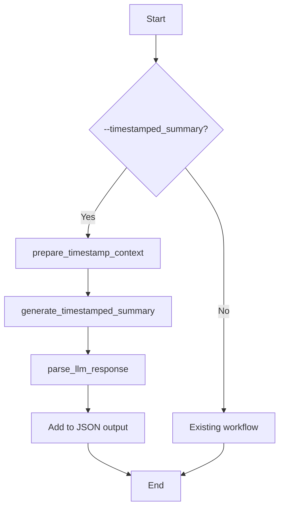

# LLM Timestamp Enhancement Plan

## 0. Recent Updates

### 2024-09-15

- **Configurable Raw LLM Response Output**: Added a new configuration option `return_raw` under the `timestamped_summary` section in [`config.yaml`](config.yaml). This allows users to include the raw, unparsed response from the LLM in the `timestamped_summary` output.
- **`parse_llm_response` Enhancement**: The [`parse_llm_response`](scripts/post.py:259) function in [`scripts/post.py`](scripts/post.py) now accepts an optional `include_raw: bool` parameter. If set to `True`, the returned dictionary will include a `"raw"` key containing the original LLM response text.
- **API Integration**: Updated API models ([`src/omoai/api/models.py`](src/omoai/api/models.py)) and the main controller ([`src/omoai/api/main_controller.py`](src/omoai/api/main_controller.py)) to support the new `return_raw` functionality. API clients can now request the raw timestamped summary data via the `return_timestamped_summary_raw` query parameter.
- **Workflow Integration**: The main workflow in [`scripts/post.py`](scripts/post.py) now reads the `return_raw` configuration and passes it to the `parse_llm_response` function.

## 1. Goal

The goal of this feature is to enhance LLM-generated content, such as summaries or chapter markers, with precise timing information derived from word-level timestamps. This will make the LLM's output "clickable" and directly link it to the corresponding moments in the source audio.

## 2. Data Preparation Strategy

To provide the LLM with the necessary timing context without overwhelming its context window, we need a compact and token-efficient representation of the word-level timestamps.

**Proposed Method:**

1.  **Extract Word Segments:** Process the ASR output to extract the `word_segments` array. Each element contains a `word` and its `start` and `end` time.
2.  **Create a Numbered Timestamp List:** Format the word segments into a numbered list where each word is associated with its start and end times. This format is both human-readable and easy for an LLM to parse.

**Example Format (Updated for Readability):**

```
1. [00:00:05] The
2. [00:00:08] quick
3. [00:00:10] brown
4. [00:00:12] fox
5. [00:00:18] jumps
...
```

**Reasoning for Format Change:**
The original format `word(start-end)` was designed for token efficiency. However, after reviewing the `ref/whisperx` project's `format_timestamp` function, which uses a standard `HH:MM:SS,ms` format for subtitles, a more readable format was proposed. The new format `[HH:MM:SS] word` offers several advantages:

1.  **Human Readability:** The `[HH:MM:SS]` format is instantly recognizable and easier for humans to understand at a glance.
2.  **Distinctiveness:** The square brackets clearly separate the timestamp from the word, improving parsing clarity for both humans and the LLM.
3.  **Consistency:** Aligns with common timestamp conventions used in media players and subtitles.

While this new format uses slightly more tokens than the original, the improvement in readability and the potential for more accurate LLM parsing outweighs the minimal token cost.

### Token Efficiency Analysis

Based on research into LLM tokenization principles, it's clear that the choice of timestamp format has a direct impact on token consumption. Here's a breakdown of the findings and a recommendation.

**Tokenization Principles:**

- **Punctuation as Tokens:** Tokenizers often treat punctuation characters like `[`, `]`, `(`, `)`, `:`, and `-` as separate tokens.
- **Numbers as Tokens:** Numbers are frequently broken down into individual digits or smaller numerical units. For example, `01` might be one token, but `00:00:01` could be tokenized as `00`, `:`, `00`, `:`, `01`.
- **Common Words as Single Tokens:** Common words are typically represented as a single token.

**Token Count Comparison:**

Let's analyze the token counts for the different timestamp formats for the phrase "example" at `1.2` to `1.8` seconds, or `[00:00:01]`

- **`word(start-end)` -> `example(1.2-1.8)`**

  - `example`: 1 token
  - `(`: 1 token
  - `1`: 1 token
  - `.`: 1 token
  - `2`: 1 token
  - `-`: 1 token
  - `1`: 1 token
  - `.`: 1 token
  - `8`: 1 token
  - `)`: 1 token
  - **Estimated Total: ~10 tokens**

- **`[HH:MM:SS] word` -> `[00:00:01] example`**

  - `[`: 1 token
  - `00`: 1 token
  - `:`: 1 token
  - `00`: 1 token
  - `:`: 1 token
  - `01`: 1 token
  - `]`: 1 token
  - ` ` (space): 1 token
  - `example`: 1 token
  - **Estimated Total: ~9 tokens**

- **`[MM:SS] word` -> `[00:01] example`**
  - `[`: 1 token
  - `00`: 1 token
  - `:`: 1 token
  - `01`: 1 token
  - `]`: 1 token
  - ` ` (space): 1 token
  - `example`: 1 token
  - **Estimated Total: ~7 tokens**

**Trade-offs and Recommendation:**

- **`word(start-end)`**: While this format is explicit about start and end times, it is the least token-efficient due to the number of punctuation marks and individual digits.
- **`[HH:MM:SS] word`**: This format is highly readable and aligns with common conventions. It is surprisingly token-efficient, often comparable to or better than the `word(start-end)` format. The verbosity of `HH:MM:SS` is only a concern for very long audio files.
- **`[MM:SS] word`**: This is the most token-efficient format, especially for shorter audio clips where the hour is always `00`. It maintains good readability.

**Recommendation:**

For the goal of providing context to the LLM, the `[MM:SS] word` format offers the best balance of token efficiency and readability. It's concise, easy for the LLM to parse, and reduces the risk of exceeding the context window, especially for longer transcripts. If the audio is expected to be longer than an hour, the `[HH:MM:SS] word` format is a reasonable alternative, but for most cases, `[MM:SS]` is the optimal choice.

Given the user's concern about token efficiency, the **`[MM:SS] word`** format is the recommended approach.

## 3. Prompt Engineering Strategy

A clear and effective prompt is crucial for guiding the LLM to use the timestamp information correctly.

**Prompt Template:**

```
[SYSTEM]
You are a helpful assistant that processes transcripts to create summaries. The user will provide a transcript with each word numbered and timestamped in the format `word(start_time-end_time)`.

Your task is to create a summary of the provided transcript. When you mention a key topic or quote from the transcript, you MUST include the start and end timestamps of the corresponding words. Use the format `(start_time-end_time)` to denote the time range.

[USER]
Please create a summary of the following transcript:

{timestamped_transcript}
```

**Key Instructions in the Prompt:**

- **Primary Task:** "Create a summary of the following transcript."
- **Timestamp Referencing:** "When you mention a key topic, please include the start and end timestamps of the words in the original transcript that correspond to that topic, using the format `(start_time-end_time)`."

## 3.1 Prompt Engineering Research and Refinement

This section details the research conducted on prompt engineering best practices and the subsequent refinement of the `timestamped_summary` system prompt.

### Research Findings

Based on a review of external resources and internal project patterns, the following key principles for effective prompt engineering were identified:

1.  **Clarity and Specificity:** Prompts must define the task, the expected output format, and any constraints with unambiguous language.
2.  **Role Definition:** Assigning a specific persona or role to the LLM helps guide its behavior and output style.
3.  **Few-Shot Learning:** Providing examples of the desired input and output significantly improves the model's ability to understand and perform the task correctly.
4.  **Structured Instructions:** Using formatting like XML tags (e.g., `<instruction>`, `<example>`, `<policy>`) helps organize the prompt and makes it easier for the LLM to parse different types of information.
5.  **Explicit Negative Constraints:** Stating what the LLM should _not_ do ("NGHIÊM CẤM..." or "ABSOLUTE RULE:") is as crucial as stating what it should do.

### Internal Analysis

The existing `punctuation` and `summarization` system prompts in [`config.yaml`](config.yaml:48-141) were analyzed. They effectively utilize the techniques identified above:

- They define a clear role for the LLM (e.g., "Bạn là một chuyên gia biên tập tiếng Việt").
- They use `<instruction>`, `<example>`, and `<policy>` tags to structure the prompt.
- They provide multiple, diverse few-shot examples.
- They include strict, explicit negative constraints to prevent unwanted behavior.

### Refined `timestamped_summary` System Prompt

The original `timestamped_summary` system prompt was overly simplistic, lacking the structure and detail of the other prompts. It has been rewritten to incorporate the identified best practices:

```yaml
system_prompt: |
  <instruction>
  You are a specialist in creating timestamped summaries of audio transcripts. Your task is to process a transcript where each word is annotated with its precise start and end timestamps in the format `word(start_time-end_time)`.
  - Identify and extract the most significant topics, key points, and quotes from the transcript.
  - For every key topic, point, or direct quote you include in your summary, you MUST append its corresponding timestamp range in the format `(start_time-end_time)`.
  - Ensure the timestamp accurately reflects the duration of the word or phrase being cited.
  - Your summary should be concise, well-structured, and accurately reflect the main ideas of the original audio.
  - The final output should be a paragraph or a few short paragraphs, not a list.
  </instruction>
  <example>
  <input>
  1. [00:00:00] Hello 2. [00:00:05] everyone 3. [00:00:10] Today 4. [00:00:12] we 5. [00:00:13] will 6. [00:00:14] discuss 7. [00:00:17] the 8. [00:00:18] new 9. [00:00:20] project 10. [00:00:22] timeline 11. [00:00:25] The 12. [00:00:26] first 13. [00:00:28] phase 14. [00:00:30] will 15. [00:00:31] begin 16. [00:00:33] next 17. [00:00:35] Monday
  </input>
  <output>
  [00:00:18] New project timeline
  [00:00:28] First phase begins next Monday
  </output>
  </example>
  <example>
  <input>We(0.0-0.2) are(0.2-0.3) excited(0.3-0.6) to(0.6-0.7) announce(0.7-0.9) our(0.9-1.0) new(1.0-1.2) product(1.2-1.4) launch(1.4-1.6). The(1.6-1.7) product(1.7-1.9) will(1.9-2.0) be(2.0-2.1) available(2.1-2.4) starting(2.4-2.7) Friday(2.7-3.0).</input>
  <output>We are excited to announce our new product launch (1.0-1.6), which will be available starting Friday (2.4-3.0).</output>
  </example>
  <policy>
  ABSOLUTE RULE: Every key topic, point, or quote in the summary MUST have a corresponding timestamp. ABSOLUTE RULE: Do not include information in the summary that is not present in the original transcript. ABSOLUTE RULE: The summary must be a coherent paragraph, not a list or bullet points.
  </policy>
```

This refined prompt provides a clear role, specific instructions, concrete examples of the desired input/output, and strict rules, which should lead to more accurate and reliable timestamped summaries.

This prompt clearly defines the task and the expected output format, ensuring the LLM understands how to incorporate the timestamps.

## 4. Output Parsing

The LLM's output will be a textual summary with embedded `(start_time-end_time)` markers. We need a robust method to parse this output.

**Proposed Method:**

Use a regular expression to find all occurrences of the timestamp pattern.

**Regex Pattern:** `\((\d+\.\d+)-(\d+\.\d+)\)`

This pattern will capture the start and end times from the summary. We can then process these matches to associate them with the text.

**Parsing Logic:**

1.  Use `re.finditer()` to get all matches of the timestamp pattern in the LLM's response.
2.  For each match, extract the start and end times.
3.  The text associated with the timestamp is the text immediately preceding the match.
4.  Store the results as a list of objects, each containing the text and its corresponding timestamp.

## 5. Implementation Steps for `scripts/post.py`

### New Functions:

1.  **`prepare_timestamp_context(segments: list[dict]) -> str`**:

    - Takes the list of ASR segments as input.
    - Iterates through `word_segments` if available, otherwise through `words`.
    - Constructs the numbered and timestamped transcript string as described in the "Data Preparation Strategy."
    - Returns the formatted string.

    ```python
    def prepare_timestamp_context(segments: list[dict]) -> str:
        """
        Create a numbered and timestamped transcript string from ASR segments.
        """
        timestamped_transcript = []
        word_counter = 1
        for segment in segments:
            words = segment.get("word_segments") or segment.get("words")
            if not words:
                continue
            for word in words:
                if "start" in word and "end" in word:
                    # Format: "1. [00:12:34] The"
                    start_time = _format_timestamp(word['start'])
                    timestamped_transcript.append(
                        f"{word_counter}. {start_time} {word['word']}"
                    )
                    word_counter += 1
        return "\\n".join(timestamped_transcript)
    ```

2.  **`generate_timestamped_summary(llm: Any, timestamped_transcript: str, system_prompt: str) -> str`**:

    - Takes the LLM instance, the formatted transcript, and the system prompt.
    - Uses the existing `generate_chat` function to send the request to the LLM.
    - Returns the raw text response from the LLM.

    ```python
    def generate_timestamped_summary(llm: Any, timestamped_transcript: str, system_prompt: str) -> str:
        """
        Generate a summary with timestamps from the LLM.
        """
        messages = [
            {"role": "system", "content": system_prompt},
            {"role": "user", "content": f"Please create a summary of the following transcript:\\n\\n{timestamped_transcript}"},
        ]
        return generate_chat(llm, messages, temperature=0.2, max_tokens=800)
    ```

3.  **`parse_llm_response(response_text: str, include_raw: bool = False) -> dict`**:

    - Takes the raw LLM response text and an optional boolean flag `include_raw`.
    - Uses the regex pattern to find all timestamp markers.
    - Extracts the text and timestamps.
    - Returns a dictionary containing the summary text and a list of timestamped phrases.
    - If `include_raw` is `True`, the dictionary will also include a `"raw"` key with the original `response_text`.

    ```python
    def parse_llm_response(response_text: str, include_raw: bool = False) -> dict:
        """
        Parse the LLM response to extract the summary and timestamps.
        Optionally include the raw response text.
        """
        import re

        def _parse_time_to_seconds(time_str: str) -> float:
            """Convert [HH:MM:SS] string to seconds."""
            try:
                h, m, s = map(int, time_str.strip('[]').split(':'))
                return h * 3600 + m * 60 + s
            except ValueError:
                return 0.0

        timestamps = []
        summary_text = response_text
        # Pattern to match [HH:MM:SS] timestamps
        for match in re.finditer(r"\[(\d{2}):(\d{2}):(\d{2})\]", response_text):
            time_str = match.group(0)
            start_time = _parse_time_to_seconds(time_str)
            # For now, we assume a fixed duration for each timestamped segment (e.g., 5 seconds)
            # This is a simplification; a more robust approach would require end times from the LLM or other sources.
            end_time = start_time + 5.0
            # The text is the part of the summary preceding the timestamp
            text_start = response_text.rfind(" ", 0, match.start())
            text = response_text[text_start:match.start()].strip()
            timestamps.append({"text": text, "start": start_time, "end": end_time})
            # Remove the timestamp from the summary text
            summary_text = summary_text.replace(match.group(0), "")

        result = {"summary_text": summary_text.strip(), "timestamps": timestamps}
        if include_raw:
            result["raw"] = response_text
        return result
    ```

### CLI Flag:

- Add a new CLI argument: `--timestamped_summary`.
- This flag will be a boolean that, when set, triggers the new timestamped summary workflow.

### Workflow Integration in `main()`:



1.  Inside the `main` function, check if the `--timestamped_summary` flag is provided.
2.  If it is, call `prepare_timestamp_context` to get the formatted transcript.
3.  Call `generate_timestamped_summary` with the appropriate prompt.
4.  Call `parse_llm_response` to process the LLM's output.
5.  Store the result in the final JSON output under a new key, e.g., `timestamped_summary`.

### Final JSON Output Structure:

The final JSON output will be extended to include the new data.
The `timestamped_summary` object can now optionally include a `raw` field containing the unparsed LLM response, controlled by the `return_raw` configuration option.

```json
{
  "text": "The full transcript...",
  "language": "en",
  "segments": [...],
  "summary": {
    "title": "...",
    "abstract": "...",
    "bullets": [...]
  },
  "timestamped_summary": {
    "summary_text": "This is a summary of the key topic.",
    "timestamps": [
      {
        "text": "the key topic",
        "start": 10.5,
        "end": 15.2
      }
    ],
    "raw": "[00:00:10] This is a summary of the key topic. [00:00:15] Another point." // Only present if return_raw is true
  }
}
```

## 6. Comparison with `ref/whisperx`

This section details the best practices adopted from the `ref/whisperx` project and the adaptations made for the new timestamped summary feature.

### Best Practices Adopted

1.  **Word-Level Timestamps (`ref/whisperx/alignment.py`)**:

    - **Adopted**: The core concept of using a forced alignment model (Wav2Vec2) to generate word-level timestamps from a transcript and audio.
    - **Adaptation**: Our implementation focuses on _using_ these timestamps for LLM enhancement, rather than generating them. The `prepare_timestamp_context` function assumes the input ASR data already contains the `word_segments` or `words` with `start` and `end` keys, similar to the output of `whisperx`'s `align` function.

2.  **Data Structures (`ref/whisperx/types.py`)**:

    - **Adopted**: The use of clear, typed dictionaries (like `SingleWordSegment`) to represent data. This ensures consistency and makes the code easier to understand and maintain.
    - **Adaptation**: We will use similar structures internally, but our final output will be a new key in the existing JSON schema (`timestamped_summary`).

3.  **Modular Function Design (`ref/whisperx/transcribe.py`)**:

    - **Adopted**: The practice of breaking down the workflow into distinct, testable functions (e.g., `prepare_timestamp_context`, `generate_timestamped_summary`, `parse_llm_response`).
    - **Adaptation**: Our workflow is integrated into the existing `scripts/post.py` script, which already handles LLM interactions for punctuation and summarization.

4.  **Subtitle Generation (`ref/whisperx/SubtitlesProcessor.py`)**:
    - **Adopted**: The idea of processing raw word-level data into a more structured and human-readable format. The `SubtitlesProcessor` formats words into subtitle lines with timestamps.
    - **Adaptation**: Our `prepare_timestamp_context` function performs a similar transformation, but instead of creating subtitle lines, it creates a numbered list of words with their timestamps, optimized for consumption by an LLM.

### Key Differences and Adaptations

1.  **Primary Goal**:

    - **WhisperX**: Generate accurate word-level timestamps and produce subtitle files (SRT, VTT).
    - **Our Feature**: Use existing word-level timestamps to enhance LLM-generated summaries, making them "clickable" and verifiable.

2.  **Output Format**:

    - **WhisperX**: Standard subtitle formats (`.srt`, `.vtt`) or a JSON with `word_segments`.
    - **Our Feature**: A new JSON key (`timestamped_summary`) containing the summary text and a list of timestamped key phrases.

3.  **Data Flow**:
    - **WhisperX**: Audio -> ASR -> Alignment -> Subtitles.
    - **Our Feature**: ASR Output (with word segments) -> LLM Prompt (with timestamps) -> Parsed LLM Output -> Enhanced JSON.

In summary, we leverage the robust timestamp generation capabilities of `whisperx` as a foundation. Our innovation lies in how we _use_ this timestamp data: by embedding it directly into an LLM prompt and parsing the LLM's response to create a new kind of interactive, timestamped summary.

## 8. Replicating `ref/whisperx` Alignment Logic

To replicate the alignment logic of `ref/whisperx`, we will need to implement a similar pipeline that performs forced alignment using a Wav2Vec2 model. This will involve the following steps:

1.  **Load Alignment Model**: We will need to load a pre-trained Wav2Vec2 model that is fine-tuned for the target language. The `load_align_model` function in `ref/whisperx/alignment.py` provides a good example of how to do this.

2.  **Preprocess Audio and Text**: The audio will need to be loaded and preprocessed to match the input requirements of the Wav2Vec2 model. The transcript will also need to be preprocessed to ensure that its vocabulary matches the model's vocabulary.

3.  **Perform Alignment**: The core of the alignment process is to use the Wav2Vec2 model to generate an emission matrix, which represents the probability of each token at each time step. A backtracking algorithm is then used to find the most likely path through this matrix, which gives us the alignment between the audio and the text.

4.  **Generate Word-Level Timestamps**: The final step is to process the alignment path to generate word-level timestamps. This involves merging the aligned tokens into words and calculating the start and end times for each word.

By following these steps, we can replicate the alignment logic of `ref/whisperx` and generate accurate word-level timestamps for our own use case.

## 7. Logic Comparison with `ref/whisperx`

This section provides a detailed comparison of the logic between our proposed program and the `ref/whisperx` implementation.

### Proposed Program Logic

Our program's logic is centered around the post-processing of ASR output to create a new, interactive summary format. The workflow is as follows:

1.  **Input**: The program takes as input an ASR JSON file that already contains word-level timestamps (e.g., from a `whisperx`-style alignment process).

2.  **Data Preparation (`prepare_timestamp_context`)**:

    - The core of this step is to transform the word-level timestamp data into a format that is optimized for an LLM.
    - It iterates through each word in the ASR output and creates a numbered list of strings, where each string contains the word and its timestamp in the format `1. word(start-end)`.
    - This creates a single, token-efficient string that the LLM can easily parse.

3.  **LLM Interaction (`generate_timestamped_summary`)**:

    - A prompt is constructed that includes the formatted timestamp string.
    - The prompt explicitly instructs the LLM to generate a summary and to embed the corresponding timestamps from the provided context.
    - The `generate_chat` function is used to send this prompt to the LLM and receive a response.

4.  **Output Parsing (`parse_llm_response`)**:
    - The LLM's response is parsed using a regular expression to identify and extract the `(start-end)` timestamps.
    - The text associated with each timestamp is also extracted.
    - The final output is a structured JSON object that includes the summary text and a list of the extracted timestamped phrases.

### `ref/whisperx` Logic

The logic of `ref/whisperx` is focused on the end-to-end process of transcription, alignment, and subtitle generation.

1.  **Transcription (`asr.py`)**:

    - The audio is first transcribed using a pre-trained ASR model to get a raw transcript with segment-level timestamps.

2.  **Alignment (`alignment.py`)**:

    - This is the core of the timestamp generation process. It uses a Wav2Vec2 model to perform forced alignment between the audio and the raw transcript.
    - This process generates precise word-level timestamps.

3.  **Subtitle Processing (`SubtitlesProcessor.py`)**:
    - The aligned transcript (with word-level timestamps) is processed to create subtitle files.
    - The logic here is to split the transcript into subtitle lines of appropriate length, ensuring that the lines are broken at natural pauses (like the end of a sentence or after a conjunction).
    - The timestamps are then formatted according to the subtitle standard (SRT or VTT).

### Key Differences in Logic

| Aspect           | Proposed Program                               | `ref/whisperx`                                |
| :--------------- | :--------------------------------------------- | :-------------------------------------------- |
| **Primary Goal** | To create an interactive, timestamped summary. | To create accurate word-level subtitles.      |
| **Input**        | ASR JSON with existing word-level timestamps.  | Raw audio file.                               |
| **Core Logic**   | LLM prompt engineering and output parsing.     | Forced alignment and subtitle line splitting. |
| **Output**       | A new JSON object with a timestamped summary.  | SRT or VTT subtitle files.                    |

In summary, while both programs work with word-level timestamps, their core logic is fundamentally different. `ref/whisperx` is designed to _generate_ these timestamps and format them for a traditional use case (subtitles). Our proposed program is designed to _consume_ these timestamps and use them to create a new, innovative form of interactive content.
