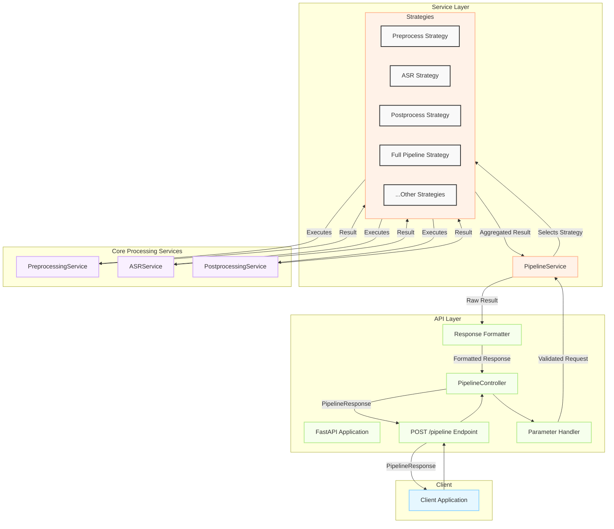

# OmoAI API Redesign Proposal

## 1. Introduction

This document outlines the proposed redesign of the OmoAI API. The motivation for this redesign stems from findings in the API Architecture Analysis Report, which identified significant code duplication and escalating complexity within the current implementation. The existing structure, with separate endpoints for `/preprocess`, `/asr`, and `/postprocess`, has led to redundant validation logic, intertwined controller responsibilities, and a service layer that is difficult to maintain and extend. This redesign aims to simplify the architecture, improve developer experience, and enhance the long-term maintainability of the API by consolidating functionality into a single, unified `POST /pipeline` endpoint.

## 2. Proposed Architecture

The new architecture introduces a streamlined and modular approach to handling audio processing requests. It centers around a single `POST /pipeline` endpoint, which delegates processing to a simplified controller logic and a unified service layer.

### 2.1. Consolidated `POST /pipeline` Endpoint

The cornerstone of the redesign is the consolidation of the existing three endpoints (`/preprocess`, `/asr`, `/postprocess`) into a single, versatile `POST /pipeline` endpoint.

**Purpose:**
This endpoint will be responsible for handling all audio processing requests. Clients will submit their audio data along with a comprehensive request payload that specifies the desired processing stages (preprocessing, ASR, postprocessing) and their respective configurations.

**Benefits:**

- **Simplified Client Interaction:** Clients no longer need to manage multiple, sequential API calls to process audio. A single request to `/pipeline` will handle the entire workflow.
- **Reduced Code Duplication:** A single endpoint eliminates the need for repetitive request validation, response formatting, and error handling logic spread across multiple controllers.
- **Improved Atomicity and Consistency:** The entire processing pipeline is treated as a single, atomic operation, reducing the chances of inconsistent states or partial results.
- **Enhanced Flexibility:** The unified request model allows for more complex and customized processing flows by enabling or disabling specific stages and providing granular configuration for each.

### 2.2. Simplified Controller Logic

The controller layer will be significantly simplified. Instead of three distinct controllers, a single `PipelineController` will manage requests to the `/pipeline` endpoint.

**Role of New Modules:**

- **Parameter Handler:**

  - **Responsibility:** This module will be responsible for parsing, validating, and normalizing the incoming `PipelineRequest` payload. It will ensure that all required parameters are present, data types are correct, and configurations for each processing stage are valid.
  - **Benefit:** Centralizing parameter handling abstracts this logic away from the controller, making it cleaner and more focused on orchestration.

- **Response Formatter:**
  - **Responsibility:** Once the service layer completes processing, the Response Formatter will take the raw result data and structure it into the standardized `PipelineResponse` Pydantic model. It ensures that all successful responses adhere to a consistent schema.
  - **Benefit:** This module guarantees a uniform response structure, simplifying client-side parsing and improving API predictability.

### 2.3. Unified Service Layer

The service layer will be refactored into a unified `PipelineService` that orchestrates the entire processing flow.

**Strategy Pattern for Processing Modes:**
The `PipelineService` will employ the Strategy design pattern to manage the different processing modes (e.g., preprocess-only, ASR-only, postprocess-only, or a combination). Each distinct processing flow will be encapsulated within its own "strategy" class.

- **How it Works:**

  1.  The `PipelineService` receives the validated request from the `PipelineController`.
  2.  Based on the `PipelineRequest`'s configuration (e.g., which stages are enabled), the `PipelineService` selects the appropriate processing strategy.
  3.  The selected strategy object then executes the defined sequence of operations (e.g., calling preprocessing, then ASR, then postprocessing services).
  4.  The `PipelineService` aggregates the results from the strategy and returns them.

- **Benefits:**
  - **Decoupling:** The core `PipelineService` is decoupled from the specific implementations of different processing flows. Adding or modifying a processing mode becomes a matter of creating or updating a strategy, without altering the main service logic.
  - **Maintainability:** Each strategy is a self-contained unit, making the code easier to understand, test, and maintain.
  - **Extensibility:** New processing modes or combinations can be introduced easily by adding new strategy classes, adhering to the Open/Closed Principle.

### 2.4. High-Level Architecture Diagram



## 2.5. Asynchronous Workflow

To support long-running tasks and improve the responsiveness of the API, an asynchronous processing mode is introduced. This allows clients to submit a task and poll for its status later, rather than waiting for the entire pipeline to complete synchronously.

### 2.5.1. Task Submission Process

The existing `POST /pipeline` endpoint will be enhanced to support an `async_mode` parameter.

- **Endpoint:** `POST /pipeline`
- **New Parameter:** `async_mode: bool` (optional, defaults to `false`)
  - If `async_mode` is set to `true`, the API will immediately acknowledge the request, validate the input, and return a `TaskCreationResponse` containing a unique `task_id`. The actual pipeline processing will be handled in the background.
  - If `async_mode` is `false` (or omitted), the endpoint will behave as before, processing the request synchronously and returning the final `PipelineResponse` or an error.

**Asynchronous Task Submission Flow:**

1.  The client sends a `PipelineRequest` to `POST /pipeline` with `"async_mode": true`.
2.  The `PipelineController` receives the request.
3.  The `ParameterHandler` validates the request.
4.  Instead of directly calling the `PipelineService` for execution, the controller passes the validated request to a `TaskManager`.
5.  The `TaskManager` generates a unique `task_id`, stores the task details (e.g., request payload, status "pending", timestamp), and queues the task for background processing.
6.  The `TaskManager` returns the `task_id` to the `PipelineController`.
7.  The controller uses the `ResponseFormatter` to construct a `TaskCreationResponse` containing the `task_id`.
8.  The API returns the `TaskCreationResponse` to the client with an HTTP status code of `202 Accepted`.

A background worker (or a pool of workers) will monitor the task queue, pick up pending tasks, and execute the pipeline by calling the `PipelineService` with the stored request payload. The task's status and results will be updated by the worker upon completion or failure.

### 2.5.2. Status Polling Endpoint

A new endpoint, `GET /pipeline/status/{task_id}`, is introduced for clients to check the progress and retrieve results of asynchronously submitted tasks.

- **Endpoint:** `GET /pipeline/status/{task_id}`
- **Description:** Retrieves the status and, if available, the results of a previously submitted asynchronous task.
- **Path Parameter:**
  - `task_id` (string, required): The unique identifier of the task, obtained from the `TaskCreationResponse`.
- **Response:** `PipelineStatusResponse`

**Status Polling Flow:**

1.  The client makes a `GET` request to `/pipeline/status/{task_id}`.
2.  The `PipelineController` (or a dedicated `StatusController`) receives the request.
3.  The controller queries the `TaskManager` (or a task result store) using the provided `task_id`.
4.  If the task is found:
    - If the task is still `pending` or `running`, the API returns a `PipelineStatusResponse` with the current status, and `null` for `result` and `errors`.
    - If the task has completed `successfully`, the API returns a `PipelineStatusResponse` with status `success`, the full `PipelineResponse` in the `result` field, and an empty `errors` list.
    - If the task `failed`, the API returns a `PipelineStatusResponse` with status `failed`, `null` for the `result`, and a list of error messages in the `errors` field.
5.  If the task is not found (e.g., invalid `task_id` or task expired), the API returns an HTTP `404 Not Found` error.

### 2.5.3. Updated High-Level Architecture Diagram (Asynchronous)

The architecture is extended to include components for managing asynchronous tasks.

```mermaid
graph TD
    subgraph Client
        C[Client Application]
    end

    subgraph "API Layer"
        A[FastAPI Application]
        B_POST[POST /pipeline Endpoint]
        B_GET[GET /pipeline/status/{task_id} Endpoint]
        PC[PipelineController]
        PH[Parameter Handler]
        RF[Response Formatter]
        TM[Task Manager]
        TQ[Task Queue]
    end

    subgraph "Service Layer"
        PS[PipelineService]
        subgraph Strategies
            S1[Preprocess Strategy]
            S2[ASR Strategy]
            S3[Postprocess Strategy]
            S4[Full Pipeline Strategy]
            SN[...Other Strategies]
        end
        BW[Background Worker(s)]
    end

    subgraph "Core Processing Services"
        PreS[PreprocessingService]
        ASRS[ASRService]
        PostS[PostprocessingService]
    end

    subgraph "Task/Result Store"
        TS[Task Storage]
    end

    C -- Async Request --> B_POST
    B_POST --> PC
    PC --> PH
    PH -- Validated Request --> PC
    PC -- Submit Task --> TM
    TM -- Stores Task --> TS
    TM -- Enqueues Task --> TQ
    TM -- task_id --> RF
    RF -- TaskCreationResponse --> PC
    PC -- 202 Accepted --> B_POST
    B_POST -- TaskCreationResponse --> C

    BW -- Polls Task --> TQ
    BW -- Gets Task Details --> TS
    BW -- Executes Pipeline --> PS
    PS -- Selects Strategy --> Strategies
    Strategies -- Executes --> PreS
    Strategies -- Executes --> ASRS
    Strategies -- Executes --> PostS
    PreS -- Result --> Strategies
    ASRS -- Result --> Strategies
    PostS -- Result --> Strategies
    Strategies -- Aggregated Result --> PS
    PS -- PipelineResponse --> BW
    BW -- Updates Task Status/Result --> TS

    C -- Poll Status --> B_GET
    B_GET -- {task_id} --> PC
    PC -- Get Task Status --> TM
    TM -- Fetches from TS --> TS
    TM -- Task Status/Result --> RF
    RF -- PipelineStatusResponse --> PC
    PC -- PipelineStatusResponse --> B_GET
    B_GET -- PipelineStatusResponse --> C

    classDef default fill:#f9f9f9,stroke:#333,stroke-width:2px;
    classDef client fill:#e6f7ff,stroke:#91d5ff,stroke-width:2px;
    classDef api fill:#f6ffed,stroke:#b7eb8f,stroke-width:2px;
    classDef service fill:#fff2e8,stroke:#ffbb96,stroke-width:2px;
    classDef core fill:#f9f0ff,stroke:#d3adf7,stroke-width:2px;
    classDef storage fill:#fff0f6,stroke:#ffadd2,stroke-width:2px;

    class C client;
    class A,B_POST,B_GET,PC,PH,RF,TM api;
    class PS,Strategies,BW service;
    class PreS,ASRS,PostS core;
    class TQ,TS storage;
```

This asynchronous enhancement provides greater flexibility and scalability, especially for resource-intensive or long-duration audio processing tasks. Clients can initiate processing and check back later, improving user experience and system resource management.

## 3. API Specification

This section provides a detailed specification for the new unified API, including the Pydantic models and example request/response bodies.

### 3.1. Pydantic Models

The following Pydantic models define the structure of the request and response bodies for the `POST /pipeline` endpoint.

#### `PipelineRequest`

This model defines the structure of the incoming request payload.

```python
from typing import Optional, Dict, Any
from pydantic import BaseModel, Field, HttpUrl

# --- Sub-models for Options ---

class ASROptions(BaseModel):
    """Configuration options for the Automatic Speech Recognition (ASR) stage."""
    model: str = Field(
        default="default",
        description="The ASR model to use for transcription."
    )
    language: str = Field(
        default="auto",
        description="The language code of the audio (e.g., 'en', 'vi', 'auto' for automatic detection)."
    )
    # Add other ASR-specific parameters as needed
    # e.g., punctuate: bool = True
    # e.g., diarize: bool = False

class PostprocessOptions(BaseModel):
    """Configuration options for the Post-processing stage."""
    apply_punctuation: bool = Field(
        default=True,
        description="Whether to apply punctuation restoration to the transcript."
    )
    apply_number_normalization: bool = Field(
        default=True,
        description="Whether to normalize number representations in the transcript."
    )
    # Add other postprocess-specific parameters as needed
    # e.g., format: Optional[str] = None # e.g., "srt", "vtt"

class PreprocessOptions(BaseModel):
    """Configuration options for the Pre-processing stage."""
    apply_noise_reduction: bool = Field(
        default=False,
        description="Whether to apply noise reduction to the input audio."
    )
    normalize_audio: bool = Field(
        default=True,
        description="Whether to normalize the audio volume."
    )
    target_sample_rate: Optional[int] = Field(
        default=16000,
        description="The target sample rate for the audio. If None, uses the model's preferred rate."
    )

# --- Main Request Model ---

class PipelineRequest(BaseModel):
    """
    The main request model for the /pipeline endpoint.
    It orchestrates the entire audio processing workflow.
    """
    audio_url: Optional[HttpUrl] = Field(
        None,
        description="Publicly accessible URL of the audio file to process. Mutually exclusive with 'audio_data_b64'."
    )
    audio_data_b64: Optional[str] = Field(
        None,
        description="Base64 encoded string of the audio file data. Mutually exclusive with 'audio_url'."
    )
    stages: Dict[str, bool] = Field(
        {"preprocess": True, "asr": True, "postprocess": True},
        description="A dictionary specifying which processing stages to enable or disable. Keys: 'preprocess', 'asr', 'postprocess'."
    )
    asr_options: Optional[ASROptions] = Field(
        default_factory=ASROptions,
        description="Configuration for the ASR stage. Used if 'asr' is True in 'stages'."
    )
    postprocess_options: Optional[PostprocessOptions] = Field(
        default_factory=PostprocessOptions,
        description="Configuration for the Post-processing stage. Used if 'postprocess' is True in 'stages'."
    )
    preprocess_options: Optional[PreprocessOptions] = Field(
        default_factory=PreprocessOptions,
        description="Configuration for the Pre-processing stage. Used if 'preprocess' is True in 'stages'."
    )
    async_mode: bool = Field(
        default=False,
        description="If true, the request will be processed asynchronously. A task_id will be returned for polling status. If false (default), the request is processed synchronously."
    )
    metadata: Optional[Dict[str, Any]] = Field(
        default_factory=dict,
        description="Optional metadata to include with the request, which can be returned in the response."
    )

    class Config:
        schema_extra = {
            "example": {
                "audio_url": "https://example.com/audio/sample.wav",
                "stages": {
                    "preprocess": True,
                    "asr": True,
                    "postprocess": True
                },
                "asr_options": {
                    "model": "whisper-large",
                    "language": "en"
                },
                "postprocess_options": {
                    "apply_punctuation": True,
                    "apply_number_normalization": False
                },
                "preprocess_options": {
                    "apply_noise_reduction": True,
                    "normalize_audio": True,
                    "target_sample_rate": 16000
                },
                "async_mode": False,
                "metadata": {
                    "user_id": "user123",
                    "session_id": "session_abc"
                }
            }
        }
```

#### `TaskCreationResponse`

This model defines the structure of the response when a task is successfully submitted for asynchronous processing.

```python
from pydantic import BaseModel, Field
from typing import Optional

class TaskCreationResponse(BaseModel):
    """
    Response model for asynchronous task submission via POST /pipeline.
    Provides a task_id to track the status of the processing job.
    """
    task_id: str = Field(
        ..., description="A unique identifier for the submitted asynchronous task."
    )
    message: str = Field(
        "Task accepted and queued for processing.", description="A message confirming task submission."
    )
    status_url: Optional[str] = Field(
        None, description="URL to poll for the task status (e.g., /pipeline/status/{task_id})."
    )

    class Config:
        schema_extra = {
            "example": {
                "task_id": "a1b2c3d4-e5f6-7890-1234-567890abcdef",
                "message": "Task accepted and queued for processing.",
                "status_url": "/api/v1/pipeline/status/a1b2c3d4-e5f6-7890-1234-567890abcdef"
            }
        }
```

#### `PipelineStatusResponse`

This model defines the structure of the response when polling the status of an asynchronous task using `GET /pipeline/status/{task_id}`.

```python
from typing import Optional, Dict, Any, List
from pydantic import BaseModel, Field

# Assuming PipelineResponse is already defined as above
# from .pipeline_response_model import PipelineResponse # Placeholder for actual import

class PipelineStatusResponse(BaseModel):
    """
    Response model for GET /pipeline/status/{task_id}.
    Provides the current status, result (if completed), and any errors for an asynchronous task.
    """
    task_id: str = Field(
        ..., description="The unique identifier of the task."
    )
    status: str = Field(
        ..., description="Current status of the task. Possible values: 'pending', 'running', 'success', 'failed'."
    )
    result: Optional[Dict[str, Any]] = Field( # Ideally, this would be PipelineResponse type
        None, description="The full PipelineResponse if the task completed successfully. Null otherwise."
    )
    errors: Optional[List[Dict[str, str]]] = Field(
        default_factory=list,
        description="A list of error messages if the task failed. Empty otherwise."
    )
    submitted_at: Optional[str] = Field( # Using string for ISO 8601 timestamp, could be datetime
        None, description="Timestamp when the task was submitted (ISO 8601 format)."
    )
    started_at: Optional[str] = Field( # Using string for ISO 8601 timestamp, could be datetime
        None, description="Timestamp when the task started processing (ISO 8601 format)."
    )
    completed_at: Optional[str] = Field( # Using string for ISO 8601 timestamp, could be datetime
        None, description="Timestamp when the task completed (either successfully or failed) (ISO 8601 format)."
    )
    progress: Optional[float] = Field(
        None,
        description="Estimated progress of the task from 0 to 100.",
        ge=0,
        le=100
    )

    class Config:
        schema_extra = {
            "example": {
                "task_id": "a1b2c3d4-e5f6-7890-1234-567890abcdef",
                "status": "success",
                "result": { # This would be the full PipelineResponse object
                    "request_id": "req-67890-fedcba",
                    "status": "success",
                    "stages_executed": {"preprocess": True, "asr": True, "postprocess": True},
                    "preprocess_result": {"processed_audio_url": "...", "duration_seconds": 65.43},
                    "asr_result": {"transcript": "Hello, this is a test.", "confidence": 0.98},
                    "postprocess_result": {"transcript": "Hello, this is a test."},
                    "metadata": {"user_id": "user-xyz-789"},
                    "execution_time_ms": 8756,
                    "errors": []
                },
                "errors": [],
                "submitted_at": "2024-09-09T09:00:00Z",
                "started_at": "2024-09-09T09:00:05Z",
                "completed_at": "2024-09-09T09:01:12Z",
                "progress": 100.0
            },
            "example_failure": {
                "task_id": "a1b2c3d4-e5f6-7890-1234-567890abcdef",
                "status": "failed",
                "result": None,
                "errors": [
                    {"stage": "asr", "message": "ASR model failed to load: Model not found."}
                ],
                "submitted_at": "2024-09-09T09:02:00Z",
                "started_at": "2024-09-09T09:02:01Z",
                "completed_at": "2024-09-09T09:02:15Z",
                "progress": 10.0
            },
            "example_pending": {
                "task_id": "a1b2c3d4-e5f6-7890-1234-567890abcdef",
                "status": "pending",
                "result": None,
                "errors": [],
                "submitted_at": "2024-09-09T09:03:00Z",
                "started_at": None,
                "completed_at": None,
                "progress": 0.0
            }
        }
```

#### `PipelineResponse`

This model defines the structure of the successful response from the `/pipeline` endpoint.

```python
from typing import Optional, Dict, Any, List
from pydantic import BaseModel, Field

# --- Sub-models for Stage Results ---

class PreprocessResult(BaseModel):
    """Results from the Pre-processing stage."""
    processed_audio_url: Optional[HttpUrl] = Field(
        None, description="URL to the pre-processed audio file, if stored."
    )
    duration_seconds: Optional[float] = Field(
        None, description="Duration of the audio in seconds."
    )
    sample_rate: Optional[int] = Field(
        None, description="Sample rate of the processed audio."
    )
    channels: Optional[int] = Field(
        None, description="Number of audio channels."
    )
    # Add other relevant preprocessing metrics or info

class ASRResult(BaseModel):
    """Results from the Automatic Speech Recognition (ASR) stage."""
    transcript: str = Field(..., description="The transcribed text.")
    confidence: Optional[float] = Field(
        None, description="Overall confidence score of the transcription (0.0 to 1.0)."
    )
    segments: Optional[List[Dict[str, Any]]] = Field(
        default_factory=list,
        description="A list of transcribed segments, each with start time, end time, and text."
    )
    language_detected: Optional[str] = Field(
        None, description="The language code detected by the ASR model."
    )
    # Add other relevant ASR metrics

class PostprocessResult(BaseModel):
    """Results from the Post-processing stage."""
    transcript: str = Field(
        ..., description="The final transcript after post-processing."
    )
    # Add other relevant postprocessing info (e.g., punctuation stats)

# --- Main Response Model ---

class PipelineResponse(BaseModel):
    """
    The main response model for the /pipeline endpoint.
    It contains the results from all enabled processing stages.
    """
    request_id: str = Field(
        ..., description="A unique identifier for the request."
    )
    status: str = Field(
        "success", description="The status of the pipeline execution (e.g., 'success', 'partial_success', 'failed')."
    )
    stages_executed: Dict[str, bool] = Field(
        ..., description="A dictionary indicating which stages were actually executed."
    )
    preprocess_result: Optional[PreprocessResult] = Field(
        None, description="Results from the Pre-processing stage, if executed."
    )
    asr_result: Optional[ASRResult] = Field(
        None, description="Results from the ASR stage, if executed."
    )
    postprocess_result: Optional[PostprocessResult] = Field(
        None, description="Results from the Post-processing stage, if executed."
    )
    metadata: Optional[Dict[str, Any]] = Field(
        None, description="Metadata included in the original request."
    )
    execution_time_ms: Optional[int] = Field(
        None, description="Total time taken to execute the pipeline in milliseconds."
    )
    errors: Optional[List[Dict[str, str]]] = Field(
        default_factory=list,
        description="A list of errors encountered during processing, if any. Each error is a dict with 'stage' and 'message'."
    )

    class Config:
        schema_extra = {
            "example": {
                "request_id": "req_12345abcde",
                "status": "success",
                "stages_executed": {
                    "preprocess": True,
                    "asr": True,
                    "postprocess": True
                },
                "preprocess_result": {
                    "processed_audio_url": "https://storage.example.com/processed/req_12345abcde.wav",
                    "duration_seconds": 120.5,
                    "sample_rate": 16000,
                    "channels": 1
                },
                "asr_result": {
                    "transcript": "This is a raw transcript from the ASR model.",
                    "confidence": 0.95,
                    "segments": [
                        {"start": 0.0, "end": 2.5, "text": "This is a raw"},
                        {"start": 2.6, "end": 5.1, "text": "transcript from the ASR model."}
                    ],
                    "language_detected": "en"
                },
                "postprocess_result": {
                    "transcript": "This is a raw transcript from the ASR model."
                },
                "metadata": {
                    "user_id": "user123",
                    "session_id": "session_abc"
                },
                "execution_time_ms": 15234,
                "errors": []
            }
        }
```

### 3.2. Example Request and Response Bodies

#### Example Request Body (JSON)

```json
{
  "audio_url": "https://example.com/audio/sample_speech.wav",
  "stages": {
    "preprocess": true,
    "asr": true,
    "postprocess": true
  },
  "asr_options": {
    "model": "whisper-medium",
    "language": "auto"
  },
  "postprocess_options": {
    "apply_punctuation": true,
    "apply_number_normalization": true
  },
  "preprocess_options": {
    "apply_noise_reduction": true,
    "normalize_audio": true,
    "target_sample_rate": 16000
  },
  "metadata": {
    "client_app": "OmoAI-WebApp-v1.2",
    "user_id": "user-xyz-789"
  }
}
```

#### Example Response Body (JSON) - Success

```json
{
  "request_id": "req-67890-fedcba",
  "status": "success",
  "stages_executed": {
    "preprocess": true,
    "asr": true,
    "postprocess": true
  },
  "preprocess_result": {
    "processed_audio_url": "https://omoai-storage.s3.amazonaws.com/processed/req-67890-fedcba.wav",
    "duration_seconds": 65.43,
    "sample_rate": 16000,
    "channels": 1
  },
  "asr_result": {
    "transcript": "hello this is a test of the omoai pipeline the audio quality seems good",
    "confidence": 0.92,
    "segments": [
      { "start": 0.5, "end": 1.8, "text": "hello this is a test" },
      { "start": 2.0, "end": 4.5, "text": "of the omoai pipeline" },
      { "start": 4.7, "end": 6.9, "text": "the audio quality seems good" }
    ],
    "language_detected": "en"
  },
  "postprocess_result": {
    "transcript": "Hello, this is a test of the OmoAI pipeline. The audio quality seems good."
  },
  "metadata": {
    "client_app": "OmoAI-WebApp-v1.2",
    "user_id": "user-xyz-789"
  },
  "execution_time_ms": 8756,
  "errors": []
}
```

#### Example Response Body (JSON) - Partial Success (ASR failed)

```json
{
  "request_id": "req-11223-aabbcc",
  "status": "partial_success",
  "stages_executed": {
    "preprocess": true,
    "asr": false,
    "postprocess": false
  },
  "preprocess_result": {
    "processed_audio_url": "https://omoai-storage.s3.amazonaws.com/processed/req-11223-aabbcc.wav",
    "duration_seconds": 65.43,
    "sample_rate": 16000,
    "channels": 1
  },
  "asr_result": null,
  "postprocess_result": null,
  "metadata": {
    "client_app": "OmoAI-WebApp-v1.2",
    "user_id": "user-xyz-789"
  },
  "execution_time_ms": 2100,
  "errors": [
    {
      "stage": "asr",
      "message": "ASR model 'whisper-medium' failed to load due to insufficient resources."
    }
  ]
}
```

## 4. Migration Guide

Migrating from the existing multi-endpoint API to the new unified `POST /pipeline` endpoint involves changes in how clients construct and send requests, as well as how they interpret responses.

### Migration Steps:

1.  **Update Request Construction:**

    - **Old Way:** Clients made separate requests to `/preprocess`, `/asr`, and `/postprocess`, often chaining them and managing intermediate data (like URLs or processed audio data).
    - **New Way:** Clients will construct a single `PipelineRequest` object.
      - Instead of separate payloads, combine all configurations into the `asr_options`, `postprocess_options`, and `preprocess_options` fields.
      - Use the `stages` field to explicitly control which parts of the pipeline run. For example, to only perform ASR, set `stages` to `{"preprocess": false, "asr": true, "postprocess": false}`.
      - Provide audio data either via `audio_url` or `audio_data_b64`. The new endpoint does not support passing pre-processed audio data from a previous `/preprocess` call; preprocessing is now an internal stage if enabled.

2.  **Update Endpoint URL:**

    - **Old Way:** Requests were sent to `POST /api/v1/preprocess`, `POST /api/v1/asr`, and `POST /api/v1/postprocess`.
    - **New Way:** All requests should be sent to the new `POST /api/v1/pipeline` endpoint (or equivalent versioned path).

3.  **Update Response Parsing:**

    - **Old Way:** Clients received distinct response structures from each endpoint (e.g., `PreprocessResponse`, `ASRResponse`, `PostprocessResponse`).
    - **New Way:** Clients will receive a single `PipelineResponse` object.
      - The results from each stage are now nested under `preprocess_result`, `asr_result`, and `postprocess_result` fields. Clients need to check these fields based on which stages were requested and executed.
      - The `stages_executed` field in the response provides clear feedback on which stages actually ran, which is crucial for handling partial failures.
      - Error handling should be updated to inspect the `errors` list within the `PipelineResponse`, which provides stage-specific error messages.

4.  **Handle Deprecation of Old Endpoints:**
    - The old endpoints (`/preprocess`, `/asr`, `/postprocess`) will be officially deprecated.
    - **Timeline:** A clear deprecation timeline will be communicated (e.g., "Old endpoints will be supported for 3 months after the release of the new pipeline endpoint. They will be removed on YYYY-MM-DD.").
    - **Action:** Clients must update their integrations to use the new `/pipeline` endpoint before the old endpoints are sunset. During the deprecation period, the old endpoints may return HTTP headers (e.g., `Deprecation: true`, `Link: </api/v1/docs>; rel="deprecated-docs"`) to warn developers.

### Example Migration Scenario:

**Scenario:** A client currently first calls `/preprocess`, then passes the result to `/asr`, and finally passes that result to `/postprocess`.

- **Old Client Code (Conceptual):**

  ```python
  # Pseudo-code for old client
  preprocessed_data = requests.post("/preprocess", json={"audio_url": "...", ...}).json()
  asr_data = requests.post("/asr", json={"audio_url": preprocessed_data["processed_url"], ...}).json()
  final_data = requests.post("/postprocess", json={"transcript": asr_data["transcript"], ...}).json()
  print(final_data["final_transcript"])
  ```

- **New Client Code (Conceptual):**

  ```python
  # Pseudo-code for new client
  pipeline_payload = {
      "audio_url": "...",
      "stages": {"preprocess": True, "asr": True, "postprocess": True},
      "asr_options": {"model": "...", "language": "..."},
      "postprocess_options": {"apply_punctuation": True},
      "preprocess_options": {"apply_noise_reduction": True}
  }
  pipeline_response = requests.post("/pipeline", json=pipeline_payload).json()

  if pipeline_response["status"] == "success":
      print(pipeline_response["postprocess_result"]["transcript"])
  else:
      print(f"Pipeline failed or partially succeeded. Errors: {pipeline_response['errors']}")
  ```

By following these steps, clients can seamlessly transition to the new, more efficient, and flexible API.
